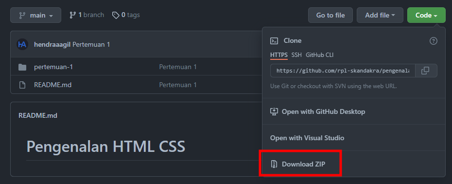

# Pengenalan HTML CSS

## Cara Download

1. Klik tombol "Download ZIP" seperti di bawah.
   
2. Ekstrak file zip yg sudah kalian download.

## Referensi Belajar

### Artikel

- [Website MDN [HTML]](https://developer.mozilla.org/en-US/docs/Web/HTML)
- [Website MDN [CSS]](https://developer.mozilla.org/en-US/docs/Web/CSS)
- [CSS Tricks](https://css-tricks.com/)

### Video

- [Playlist HTML Web Progamming UNPAS](https://www.youtube.com/playlist?list=PLFIM0718LjIVuONHysfOK0ZtiqUWvrx4F)
- [Playlist CSS Dasar Web Progamming UNPAS](https://www.youtube.com/playlist?list=PLFIM0718LjIUBrbm6Gdh6k7ZUvPIAZm7p)
- [Playlist CSS Layouting Web Progamming UNPAS](https://www.youtube.com/playlist?list=PLFIM0718LjIUu4Ju9GUL5zpLcuq08TKYr)

## Roadmap Web Developer

- [Perbedaan Frontend & Backend](https://glints.com/id/lowongan/perbedaan-front-end-dan-back-end)
- [Frontend Developer](https://roadmap.sh/frontend)
- [Backend Developer](https://roadmap.sh/backend)
